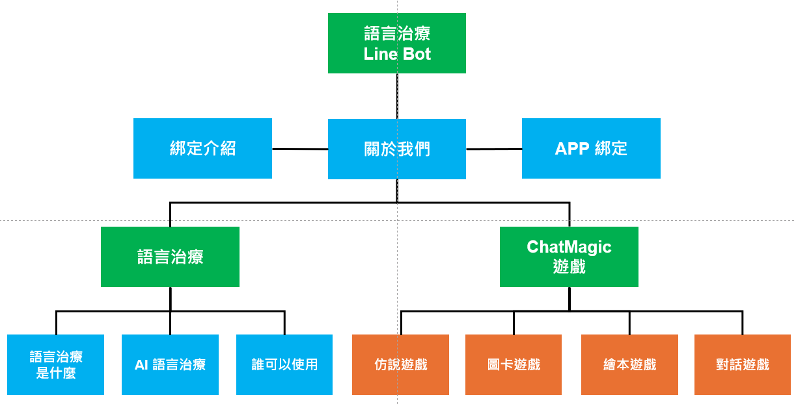
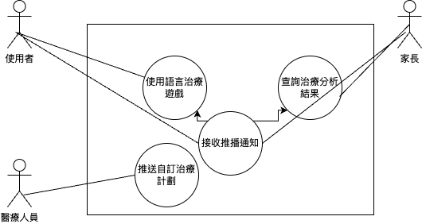

## FDD 圖

---

## 功能性需求 (Functional Requirements)

1. **即時聊天功能**
   - 支援用戶與客服之間的即時聊天，能夠迅速回應用戶的問題與需求。
   - 提供ＬＩＮＥ客服後台。

2. **自動回覆機器人**
   - 系統具備自動回覆功能，能根據用戶輸入的關鍵字或意圖，自動發送常見問題的解答或引導用戶進行進一步操作。
   - 使用RASA或其他NLP模型進行自然語言理解，提供智能化的對話處理，並能根據機器學習結果持續改進回覆準確性。

3. **工單系統整合**
   - 當客服無法即時解決問題時，允許將用戶問題轉為工單，並分派給適合的部門或客服人員進行後續處理。
   - 工單應包含詳細的用戶問題、對話記錄以及問題狀態（如待處理、已解決等）。

4. **客服人員分配與管理**
   - 系統能夠根據不同的用戶需求自動分配合適的客服人員處理，並支持多位客服同時處理不同的用戶。
   - 提供客服績效管理，統計客服人員的回覆速度、解決問題的效率和客戶滿意度。

5. **客戶資料管理**
   - 支援查看用戶的歷史對話記錄、過往的工單與互動紀錄，以便更好地為用戶提供個性化服務。
   - 將用戶的資料和對話記錄存儲於資料庫，方便查詢和統計分析。

6. **多語言支援**
   - 系統應支援多語言，根據用戶的語言偏好提供相應語言的回覆。
   - 機器人能夠識別不同語言，並切換至合適的對話模式。

## 非功能性需求 (Non-Functional Requirements)

1. **可用性**
   - 系統應保持高可用性，能夠24/7運行，確保用戶隨時可以聯繫客服。
   - 提供故障備援機制，保證系統即使在出現部分故障時也能保持最小功能運作。

2. **擴展性**
   - 系統能夠輕鬆地新增更多平台的支援或整合其他第三方工具，如CRM或數據分析工具。
   - 客服人員數量增加時，系統應能根據需求動態調整，保證性能穩定。

3. **安全性**
   - 客戶資料應經過加密處理，確保所有用戶的個人資訊與對話記錄都得到保護，防止未經授權的存取。
   - 支援安全的身份驗證系統，確保只有經過授權的客服人員和用戶可以訪問系統。

4. **性能**
   - 系統應能夠支持高並發訪問，特別是在節日或促銷活動期間，大量用戶同時聯繫客服時，系統應保持快速響應。
   - 應進行壓力測試，確保在大量客戶同時發起請求的情況下依然穩定運行。

5. **可維護性**
   - 系統架構應具備良好的可維護性，方便開發者進行修補、升級或功能擴展。
   - 提供完整的系統日誌與錯誤追蹤功能，方便問題排查。

6. **合規性**
   - 系統應符合當地與國際的隱私法規，如GDPR，確保用戶個人資料的合法使用與保護。
   - 對於與第三方系統的整合，應確保符合相應的協議和法規要求。

---

## 使用案例圖說明

使用案例 1：使用者透過LINE官方帳號進行語言治療遊戲

	•	角色：使用者（孩童）
	•	流程：
	1.	使用者在LINE官方帳號中收到語言治療遊戲的推播消息。
	2.	使用者點擊消息並進入遊戲界面。
	3.	系統根據預設的語言治療計劃進行互動。
	4.	遊戲結束後，系統會生成治療效果報告並推送給使用者。

使用案例 2：家長通過LINE官方帳號查詢治療分析結果

	•	角色：家長
	•	流程：
	1.	家長收到LINE推播消息，通知有新的語言治療分析結果。
	2.	家長點擊消息，進入分析結果頁面。
	3.	系統展示該孩童的語言治療進度和效果，並提供建議。
	4.	家長可以選擇下載詳細報告或聯繫醫療人員進一步了解。

使用案例 3：醫療人員通過LINE官方帳號推送自訂治療計劃

	•	角色：醫療人員
	•	流程：
	1.	醫療人員登入系統並選擇特定的使用者（孩童）。
	2.	系統顯示該孩童的歷史治療數據。
	3.	醫療人員設定新的語言治療計劃，並通過LINE推送給使用者。
	4.	系統記錄新的治療計劃並啟用自動推播提醒。

